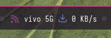
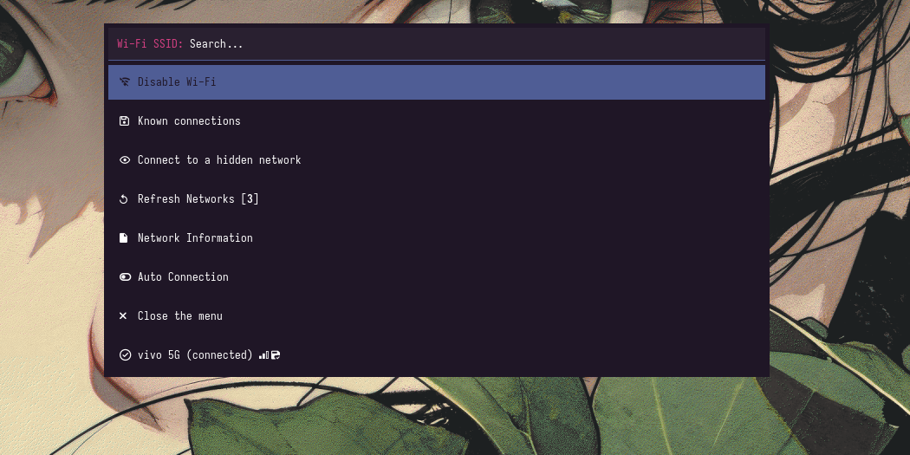

# Enhanced Seconds Bar Module for Linux Module ( Shell-Script )

This package provides a visual seconds indicator module for Linux desktop module .

---

<p align="center">
  
</p>

<p align="center">
  
  
</p>

---

## Files Included

1. **secondsbar.sh** - Main seconds bar script
2. **user_modules.ini** - Module configuration
3. **README.md** - This file

---

## Features

- Visual 12-segment bar showing seconds (0-60)
- Color gradient from green to red as seconds progress
- Clock icon that updates every 5 minutes (12 icons for 12 positions)
- Real-time updates

---

## Installation

### Step 1: Install Dependencies
```bash
# No additional dependencies required
```

### Step 2: Create Directory
```bash
mkdir -p ~/your_path
```

### Step 3: Copy Files
```bash
cp secondsbar.sh ~/your_path/
cp user_modules.ini ~/your_path/
```

### Step 4: Make Executable
```bash
chmod +x ~/your_path/secondsbar.sh
```

### Step 5: Update Paths in user_modules.ini
Open `user_modules.ini` in a text editor and edit:

| Line | Edit This | Change To |
|------|-----------|----------|
| 4 | `exec = ~/your_path/secondsbar.sh` | (adjust path if different) |

### Step 6: Enable Module in your config
Open your polybar config file:

1. Add include:
```ini
include-file = ~/your_path/user_modules.ini
```

2. Add to bar:
```ini
[bar/top]
modules-right = secondsbar ( eg, modules-right/center/left = battery secondsbar )
```

---

## Usage

Shows a visual countdown representing the current second (0-60) as a 12-segment bar. The bar fills from green to red as the minute progresses.

---

## Requirements

- Linux desktop with polybar/Waybar or other

---

## Font Reference

This module uses the following fonts (font-n = T(n+1)):

| Tag | Font Number | Font Name | Size |
|-----|-------------|-----------|------|
| T21 | font-20 | Iosevka Nerd Font | 14;3.1 |
| T22 | font-21 | Iosevka Nerd Font | 7;2 |

**Note:** Ensure these fonts are defined in your config:

```ini
font-20 = "Iosevka Nerd Font:size=14;3.1"
font-21 = "Iosevka Nerd Font:size=7;2"
```

---

## License

This project is licensed under the MIT License - see the [LICENSE](LICENSE) file for details.
